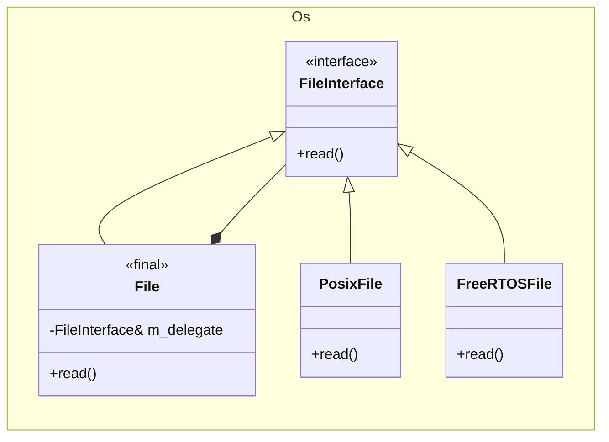

# Operating System Abstraction Layer (OSAL)

## 1. Introduction

### 1.1 Purpose
The Operating System Abstraction Layer (OSAL) provides a portable interface to operating system services for the framework. It abstracts platform-specific OS functionality behind a common API, enabling F´ applications to run on multiple operating systems without modification to the source code.

### 1.2 Scope
This document describes the high-level architecture and design of the OSAL, including its abstraction patterns, supported features, and implementation strategy. It does not provide detailed API specifications or implementation details.


## 2. Core Services

Core services are those that directly wrap OS primitives and are implemented by each platform backend.  They form the foundation upon which derived and generic services are built.

### 2.1 Concurrency

| Service | Purpose |
|---|---|
| **Mutex** | Mutual-exclusion lock and RAII `ScopeLock` helper. |
| **Task** | Thread creation, joining, and lifecycle management including start/stop callbacks. |
| **Queue** | Inter-task message passing with configurable depth, priority support, and blocking modes. |

### 2.2 File system

| Service | Purpose |
|---|---|
| **File** | Open, read, write, seek, flush, and CRC computation on files. |
| **Directory** | Open, iterate, and create directory entries. |
| **FileSystem** | Higher-level operations: remove, move/rename, copy, stat, query free space, and working-directory management. |

### 2.3 System Resources

| Service | Purpose |
|---|---|
| **RawTime** | Access to the system clock for measuring time intervals. |
| **Cpu** | CPU count and per-CPU usage statistics. |
| **Memory** | System memory usage statistics. |

### 2.4 Console

| Service | Purpose |
|---|---|
| **Console** | Write messages to the system console. |

## 3. Derived Services

Derived services are built on top of core services, providing higher-level abstractions that are implemented through the usage of core services.

| Service | Purpose | Core Services Used |
|---|---|---|
| **ConditionVariable** | Condition-variable signaling, paired with Mutex for producer/consumer patterns. | Mutex |
 |**ScopeLock** | RAII helper for automatically acquiring and releasing a Mutex within a specific scope. | Mutex |
| **IntervalTimer** | Lightweight start/stop timer for measuring elapsed microseconds. | RawTime |

## 4. Generic Services

Generic services are implemented in the `Os::Generic` namespace and are not tied to platform-specific functionalities. They provide utilities or abstractions that are not tied to any specific OS, but are related to OS-level operations and are therefore included in the `Os` module.

| Service | Purpose |
|---|---|
| **PriorityQueue** | Heap-based priority queue implementation |


## 5. Implementation Architecture

### 5.1 Delegate Pattern

Every OSAL _core service_ (e.g. File, Task, Mutex, etc.) follows a uniform three-layer pattern:

| Layer | Example | Description |
|---|---|---|
| Interface | [`Os::FileInterface`](../File.hpp#L27) | A pure-virtual base class that defines the contract for a given OS service. |
| Wrapper | [`Os::File`](../File.hpp#L225) | A `final` concrete class that holds a reference to the interface delegate constructed inside it. Application code interacts exclusively with the wrapper. |
| Implementation | [`Os::Posix::File`](../Posix/File.hpp) | A concrete class that implements the interface. This is what needs to be implemented to support a new OS on F Prime. |

This pattern allows for the selection of the implementation used for a given build to be performed through the build system at link-time: CMake chooses which `Default*.cpp` file to link, and that file provides the `getDelegate` factory function for a given OSAL implementation.

The following diagram (simplified for brevity) illustrates the relationship between these layers for the File service as an illustration.  The same pattern applies to all other services. In the final `Os::File` wrapper, the OS functions (e.g. `open()`, `read()`, `close()`) are forwarded to its `m_delegate` which is a reference to an implementation of the `Os::FileInterface`, which is implemented by the platform-specific implementation class.



### 5.2 API usage

Application code interacts exclusively with the wrapper classes (e.g., `Os::File`) and never directly with the interfaces or implementations.  The wrapper forwards calls to the delegate interface, which is implemented by the platform-specific implementation class.

There are two usage patterns for the wrapper classes:

| Usage Pattern | Description | Service | Example Usage |
|---|---|---|---|
| **Singletons** | Global state and/or accessed through static methods | FileSystem, Cpu, Memory, Task | Trough a static call:<br>```Os::FileSystem::rename(source, destination);``` |
| **Handles** | Represents an OS object that carries state | File, Directory, Mutex, Task, Queue, Console | Through an instance:<br>```Os::File my_file; my_file.open("path/to/file.txt");``` |

The full API for each service is documented in the header files in the [`Os/` module](../).

> [!NOTE]
> `Os::Task` exposes both usage patterns. `Os::Task::delay()` is a static method that blocks the current task for a specified duration, while `Os::Task` instances represent individual tasks that can be started and stopped.

### 5.3 Initialization

`Os::init()` is called once at system startup.  It initializes the singleton instances used by
services that have global state (Console, FileSystem, Cpu, Memory, Task).

While calling `Os::init()` is not strictly required, it does provide a deterministic place to initialize all singletons.  When not called, singletons are initialized at the time of their first use.

### 5.4 Error Handling

All operations return a typed `Status` enumeration specific to each service.  Platform
backends translate native error codes (e.g., `errno`) into these status values so that callers
never need to interpret platform-specific errors.

## 6. OSAL Implementations

The following OSAL implementations are available in the core F´ repository:

| Backend | Location | Description |
|---|---|---|
| **Posix** | `Os/Posix/` | Full implementation using POSIX APIs (`pthread`, file I/O, `clock_gettime`, etc.).  Serves as the default for Linux, macOS, and other POSIX compliant systems. |
| **Stub** | `Os/Stub/` | No-op implementations that return `Status::NOT_SUPPORTED`. Useful while some implementations are not available to a platform. |

Additional OSAL implementations are available through platform support packages. For more information, see [Supported Platforms](../../docs/user-manual/framework/supported-platforms.md) or search for a platform support package in the [fprime-community](https://github.com/fprime-community) GitHub organization.

OSAL selection is controlled by the CMake build system.  Each backend provides a set of `Default<ServiceName>.cpp` files; the build includes exactly one such file per service, giving the linker a single definition of each `getDelegate` factory method which initializes the wrapper's delegate reference to the appropriate implementation.

## 7. Resources

- [How-To: Implement an OSAL](../../docs/how-to/implement-osal.md) — Step-by-step guide to implementing a new OSAL backend.
- [Posix OSAL implementation](https://github.com/nasa/fprime/tree/devel/Os/Posix) — Reference implementation for POSIX systems.
- [fprime-zephyr](https://github.com/fprime-community/fprime-zephyr) — OSAL implementation for Zephyr RTOS.
- [fprime-vxworks](https://github.com/fprime-community/fprime-vxworks) - OSAL implementation for VxWorks RTOS.
- [fprime-freertos](https://github.com/fprime-community/fprime-freertos/tree/main/FreeRTOS/Os) - OSAL implementation for FreeRTOS.
