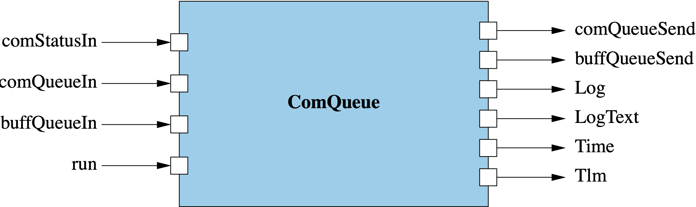

# Svc::ComQueue (Active Component)

## 1. Introduction

`Svc::ComQueue` is an  F´ active component that functions as a priority queue of buffer types. Messages are dequeued and forwarded in order of priority when a `Fw::Success::SUCCESS` signal is received on the `comStatusIn` port. `Fw::Success::SUCCESS` is accepted in three contexts: (1) at start-up to initiate data flow, (2) in response to a previously sent message, and (3) after a previous `Fw::Success::FAILURE` to indicate recovery. Receiving a `Fw::Success::FAILURE` results in the queues being paused until a subsequent `Fw::Success::SUCCESS` is received.

`Svc::ComQueue` is configured with a queue depth and queue priority for each incoming `Fw::Com` and `Fw::Buffer` port by passing in a configuration table at initialization. 
Queued messages from the highest priority source port are serviced first and a round-robin algorithm is used to balance between ports of shared priority.

`Svc::ComQueue` is designed to act alongside instances of the [communication adapter interface](../../../docs/reference/communication-adapter-interface.md) and implements the communication queue [protocol](../../../docs/reference/communication-adapter-interface.md#communication-queue-protocol).

## 2. Assumptions

1. Incoming buffers to a given port are in priority order
2. Data is considered to be successfully sent when a `Fw::Success::SUCCESS` signal is received in response to that data
3. The communication adapter is responsible for any retransmission of failed data and for emitting a recovery `Fw::Success::SUCCESS` after a failure
4. The system includes downstream components implementing the
 [communications adapter](../../../docs/reference/communication-adapter-interface.md)
5. An initial `Fw::Success::SUCCESS` will be received on `comStatusIn` to initiate data flow (typically at start-up or driver connection)

## 3. Requirements

| Requirement      | Description                                                                                                                             | Rationale                                                               | Verification Method |
|------------------|-----------------------------------------------------------------------------------------------------------------------------------------|-------------------------------------------------------------------------|---------------------|
| SVC-COMQUEUE-001 | `Svc::ComQueue` shall queue `Fw::Buffer` and `Fw::ComBuffer` received on incoming ports.                                                | The purpose of the queue is to store messages.                          | Unit Test           |
| SVC-COMQUEUE-002 | `Svc::ComQueue` shall output exactly one `Fw::Buffer` (wrapping the queued data units) on a received `Fw::Success::SUCCESS` signal. `Fw::Success::SUCCESS` is valid at start-up (to initiate flow), in response to a sent message, or after a previous `Fw::Success::FAILURE` (to indicate recovery).           | `Svc::ComQueue` obeys the [communication adapter interface protocol](../../../docs/reference/communication-adapter-interface.md#communication-queue-protocol).     | Unit Test     |
| SVC-COMQUEUE-003 | `Svc::ComQueue` shall pause sending on `Fw::Success::FAILURE` and resume on the next `Fw::Success::SUCCESS` signal.               | `Svc::ComQueue` should not send to a failing communication adapter.     | Unit Test           |
| SVC-COMQUEUE-004 | `Svc::ComQueue` shall have a configurable number of `Fw::Com` and `Fw::Buffer` input ports.                                             | `Svc::ComQueue` should be adaptable for a number of projects.           | Inspection          |
| SVC-COMQUEUE-005 | `Svc::ComQueue` shall select and send the next priority `Fw::Buffer` and `Fw::ComBuffer` message in response to `Fw::Success::SUCCESS`. | `Svc::ComQueue` obeys the [communication adapter interface protocol](../../../docs/reference/communication-adapter-interface.md#communication-queue-protocol).     | Unit test           |
| SVC-COMQUEUE-006 | `Svc::ComQueue` shall periodically telemeter the number of queued messages per-port in response to a `run` port invocation.             | `Svc::ComQueue` should provide useful telemetry.                        | Unit Test           | 
| SVC-COMQUEUE-007 | `Svc::ComQueue` shall emit a queue overflow event for a given port when the configured depth is exceeded. Messages shall be discarded.  | `Svc::ComQueue` needs to indicate off-nominal events.                   | Unit Test           | 
| SVC-COMQUEUE-008 | `Svc::ComQueue` shall implement a round robin approach to balance between ports of the same priority.                                   | Allows projects to balance between a set of queues of similar priority. | Unit Test           |
| SVC-COMQUEUE-009 | `Svc::ComQueue` shall keep track and throttle queue overflow events per port.                                                           | Prevents a flood of queue overflow events.                              | Unit test           | 
| SVC-COMQUEUE-010 | `Svc::ComQueue` shall return ownership of incoming buffers once they have been enqueued.                                                | Memory management                                                       | Unit test           | 
| SVC-COMQUEUE-011 | `Svc::ComQueue` shall provide a command to flush queued items.      | Queue management              | Unit test           | 

## 4. Design
The diagram below shows the `Svc::ComQueue` component.

### 4.1. Ports
`Svc::ComQueue` has the following ports:

| Kind          | Name              | Port Type                             | Usage                                                    |
|---------------|-------------------|---------------------------------------|----------------------------------------------------------|
| `output`      | `dataOut`         | `Svc.ComDataWithContext`              | Port emitting queued messages                            |
| `sync input`  | `dataReturnIn`    | `Svc.ComDataWithContext`              | Port retrieving back ownership buffers sent on dataOut   |
| `async input` | `comStatusIn`     | `Fw.SuccessCondition`                 | Port for receiving the status signal                     |
| `async input` | `comPacketQueueIn`| `[ComQueueComPorts] Fw.Com`           | Port array for receiving Fw::ComBuffers                  |
| `async input` | `bufferQueueIn`   | `[ComQueueBufferPorts] Fw.BufferSend` | Port array for receiving Fw::Buffers                     |
| `output`      | `bufferReturnOut` | `[ComQueueBufferPorts] Fw.BufferSend` | Port array returning ownership of buffers received on bufferQueueIn |

> [!NOTE]
> ComQueue also has the port instances for autocoded functionality for events, telemetry and time.

### 4.2. State
`Svc::ComQueue` maintains the following state:

1. `m_queues`: An array of `Types::Queue` used to queue per-port messages.
2. `m_prioritizedList`: An instance of `Svc::ComQueue::QueueMetadata` storing the priority-order queue metadata.
3. `m_state`: Instance of `Svc::ComQueue::SendState` representing the state of the component. See: 4.3.1 State Machine
4. `m_throttle`: An array of flags that throttle the per-port queue overflow messages.

### 4.2.1 State Machine

The `Svc::ComQueue` component runs the following state machine. It has two states:

| State   | Description                                                                                   |
|---------|-----------------------------------------------------------------------------------------------|
| WAITING | `Svc::ComQueue` is waiting on `SUCCESS` before attempting to send an available buffer         |
| READY   | `Svc::ComQueue` had no queued buffers and will send the next buffer immediately when received |

The state machine will transition between states when a status is received and will transition from `READY` when a new
buffer is received. `FAILURE` statuses keep the `Svc::ComQueue` in `WAITING` state whereas a `SUCCESS` status will
either send a buffer and transition to `WAITING` or will have no buffers to send and will transition into `READY` state.
Buffers are queued when in `WAITING` state.

`Fw::Success::SUCCESS` triggers a transition from `WAITING` to either `WAITING` (if a buffer was sent) or `READY` (if no buffers are queued). This SUCCESS is valid in three contexts per the [Communication Queue Protocol](../../../docs/reference/communication-adapter-interface.md#communication-queue-protocol): at start-up, in response to a sent message, or after a previous FAILURE indicating recovery.

### 4.3 Model Configuration
`Svc::ComQueue` has the following constants, that are configured in `AcConstants.fpp`:

1. `ComQueueComPorts`: number of ports of `Fw.Com` type in the `comPacketQueueIn` port array.
2. `ComQueueBufferPorts`: number of ports of `Fw.BufferSend` type in the `bufferQueueIn` port array.

### 4.4 Runtime Setup
To set up an instance of `ComQueue`, the following needs to be done: 
1. Call the constructor and the init method in the usual way for an F Prime active component. 
2. Call the `configure` method, passing in an array of `QueueConfiguration` type, the size of the array, 
and an allocator of `Fw::MemAllocator`. The `configure` method foes the following:

   1. Ensures that the total size and config size are the same value
   2. Ensures that priority values range from 0 to the total size value
   3. Ensures that every entry in the queue containing the prioritized order of the com buffer and buffer data have been 
   initialized. 
   4. Ensures that there is enough memory for the com buffer and buffer data we want to process

### 4.5 Port Handlers

#### 4.5.1 bufferQueueIn
The `bufferQueueIn` port handler receives an `Fw::Buffer` data type and a port number. 
It does the following:

1. Ensures that the port number is between zero and the value of the buffer size 
2. Enqueue the buffer onto the `m_queues` instance 
3. Returns a warning if `m_queues` is full

In the case where the component is already in `READY` state, this will process the queue immediately after the buffer
is added to the queue.

#### 4.5.2 comPacketQueueIn
The `comPacketQueueIn` port handler receives an `Fw::ComBuffer` data type and a port number. 
It does the following:

1. Ensures that the port number is between zero and the value of the com buffer size
2. Enqueue the com buffer onto the `m_queues` instance
3. Returns a warning if `m_queues` is full

In the case where the component is already in `READY` state, this will process the
queue immediately after the buffer is added to the queue.

#### 4.5.3 comStatusIn
The `comStatusIn` port handler receives a `Fw::Success` status. This triggers the component's state machine to change
state. For a full description see [4.2.1 State Machine](#4.2.1-State-Machine).
 
#### 4.5.4 run
The `run` port handler does the following: 
1. Report the high-water mark for each queue since last `run` invocation via telemetry
2. Clear each queue's high-water mark

### 4.6 Telemetry

| Name           | Type               | Description                                               |
|----------------|--------------------|-----------------------------------------------------------|
| comQueueDepth  | Svc.ComQueueDepth  | High-water mark depths of queues handling `Fw::ComBuffer` |
| buffQueueDepth | Svc.BuffQueueDepth | High-water mark depths of queues handling `Fw::Buffer`    |

### 4.7 Events

| Name                  | Description                                                        |
|-----------------------|--------------------------------------------------------------------|
| QueueOverflow         | WARNING_HI event triggered when a queue discards data              |
| QueuePriorityChanged  | ACTIVITY_HI event triggered when a user changes a queue's priority |

### 4.8 Commands

| Name               | Description                                                                                           |
|--------------------|-------------------------------------------------------------------------------------------------------|
| FLUSH_QUEUE        | Flushes all queued items from the specified queue type and index, returning ownership of any buffers. |
| FLUSH_ALL_QUEUES   | Flushes all queued items from all queues, returning ownership of any buffers.                         |
| SET_QUEUE_PRIORITY | Changes a queue's priority and re-sorts all queues                           |

### 4.9 Helper Functions

#### 4.9.1 sendComBuffer
Stores the com buffer message, sends the com buffer message on the output port, and then sets the send state to waiting.

#### 4.9.2 sendBuffer
Stores the buffer message, sends the buffer message on the output port, and then sets the send state to waiting.

#### 4.9.3 processQueue
In a bounded loop that is constrained by the total size of the queue that contains both
buffer and com buffer data, do:

   1. Check if there are any items on the queue, and continue with the loop if there are none.
   2. Store the entry point of the queue based on the index of the array that contains the prioritized data.
   3. Compare the entry index with the value of the size of the queue that contains com buffer data.
      1. If it is less than the size value, then invoke the sendComBuffer function.
      2. If it is greater than the size value, then invoke the sendBuffer function.
   4. Break out of the loop, but enter a new loop that starts at the next entry and linearly swap the remaining items in
the prioritized list.

#### 4.9.4 enqueue

Attempts to enqueue the buffer onto the queue index, logs a (throttled) warning if data is discarded, and immediately processes the queue if state is `READY`.

#### 4.9.5 drainQueue

Pops all messages out of the queue at queueIndex, `index`.

#### 4.9.6 getQueueNum

Converts a `queueType` & `portNum` into an index into the `m_queues` array--translates between user facing index system & internal one.
