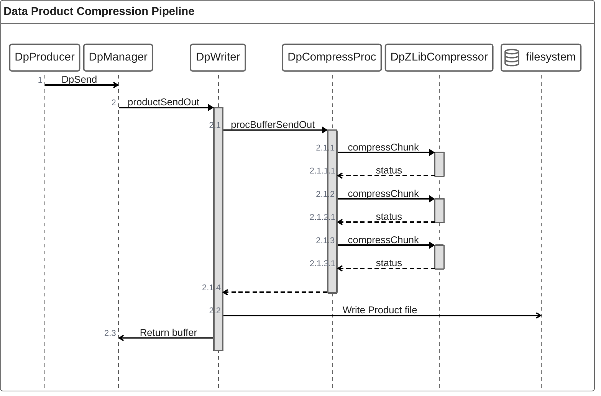

# Svc::DpCompressProc

`Svc::DpCompressProc` is a Data Product Processor component to assist in creating compressed data products. `Svc::DpCompressProc` does not perform any compression itself. Instead it manages the compression process and the creation of a compressed data product format in the place of the original uncompressed component.


## Usage Examples

See DataProduct subtopology

### Diagrams




### Typical Usage

```
     procBufferSendOut    compressChunk
 +--------+    +--------------+    +----------------+
 |DpWriter| -> |DpCompressProc| -> |DpZLibCompressor|
 +--------+    +--------------+    +----------------+
```

## Port Descriptions
| Name | Description |
|---|---|
|compressChunk| Pass chunks of the original file data to a compressor. See detailed documentation|

## Component States

None. DpCompressProc is stateless between invocations

## Parameters
| Name | Description |
|---|---|
|ENABLE| Enable compression. If disable then DpCompressProc always returns the original data product uncompressed
|CHUNK\_SIZE | Size, in bytes, to chunk the incoming data product for compression. Larger sizes generally result in better compression ratio at the cost of more memory needed by the compressor |

## Requirements
Add requirements in the chart below
| Name | Description | Validation |
|---|---|---|
|SVC-DPCOMPRESSPROC-001 | `Svc::DpCompressProc` shall return the passed `Fw::Buffer` as either a valid compressed data product or the original uncompressed data product. However the data checksum for the container does not need to be valid in the returned product | Unit Test
|SVC-DPCOMPRESSPROC-002 | `Svc::DpCompressProc` shall not allocate additional memory when processing the container. This does not apply to any downstream compressor which is allow to allocate memory | Unit Test
|SVC-DPCOMPRESSPROC-003 | `Svc::DpCompressProc` shall support a user modifyable chunking size | Unit Test


## Detailed Documentation

### Data Product Compression Algorithm

`Svc::DpCompressProc` is passed an `Fw::Buffer` containing a Data Product container. When `Svc::DpCompressProc` returns the port call the container will be in one of two states.

1. `Svc::DpCompressProc` was unable to compress any chunks in the container. The original container is returned unmodified
1. `Svc::DpCompressProc` was able to compress at least one chunk in the container. The container is modified to be a compressed data product

`Svc::DpCompressProc` does this without allocating any additional buffers, which allows it work work effectively on low-memory systems. To do this each chunk is passed to the compressor with two pieces of metadata, a minimum necessary compression and a write offset

### CompressChunk port

The ComressChunk port call is a synchronous port call with three arguments, buffer, min\_compression and write\_offset and a return enum CompressionAlgorithm

The buffer, an `Fw::Buffer`, is a chunk of the original data product container. The compressor will overwrite this buffer if it is able to compress the product. The compressor must also update the size of the buffer if compression took place.

min\_compression repressents the minimum amount of compression necessary for the compression to be useful. In order to return a compression data product, with the necessary compression record headers prepended, some chunks may need to be compressed with sufficient free space to accomidate the addition of these buffers. The value is a the maximum number of bytes that can be returned in the `Fw::Buffer`

In some cases it is necessary to place the compressed chunk at an offset within the passed `Fw::Buffer`. The write offset informs the compressor where to place the compressed data within the `Fw::Buffer` to accommodate any necessary headers.
// TODO: Now that I'm thinking about it more, is this necessary? Would it be more straightforward to always place the buffer at the beginning of the `Fw::Buffer` and memmove it as necessary?

The return value of the compressor is an enumeration with the compression algorithm used to compress the data, or uncompressed. If the compressor was unable to compress the data it must return the orignal buffer unmodified and the UNCOMPRESSED enumerated value. If the buffer was compressed then it should return the enumerated value that corresponds to the compression algorithm used. This value will be included in the compressed record header and used to decompress the product in the ground tools.

### Compressed Data Product Format

A compressed record contains an uncompressed data product header, with the same metadata as the original product, and a compressed data section. The data checksum corresponds to the compressed data section not to the original product.

The compressed data section is composed of N DpCompressProc.CompressionRecord array records. This is a special record id that the ground tools may use to recognize compressed data products and decompress before parsing the product.

A CompressionRecord is a U8 array type, where the serialized data is a `Svc::CompressionMetadata` structure followed by the compressed data. The `SvC::CompressionMetadata` structure contains any metadata necessary to decompress the product, such as the compression algorithm used.

Each compressed chunk is assigned an individual CompressionRecord however multiple contiguous uncompressed chunks will share a single CompressionRecord.


#### Original Product

+----------+
|  Header  |
+----------+
| Record 1 |
+----------+
| Record 2 |
+----------+
| Record 3 |
+----------+
|   ....   |
+----------+
| Record N |
+----------+

is chunked to the following where (C) are compressible chunks and (U) are uncompressible chunks. The chunkink does not take the original record structure into account.
+-------------+
|   Header    |
+-------------+
| Chunk 1 (C) | 
+-------------+
| Chunk 2 (U) | 
+-------------+
| Chunk 3 (U) | 
+-------------+
| Chunk 4 (C) | 
+-------------+

Is turned into the following compressed data product
+-------------+
|   Header    |
+-------------+
|  Compessed  |
|   Record 1  |
|   Metadata  |
| Chunk 1 (C) | 
+-------------+
|  Compessed  |
|   Record 2  |
|   Metadata  |
| Chunks 2 & 3|
+-------------+
|  Compessed  |
|   Record 3  |
|   Metadata  |
| Chunk 3 (C) | 
+-------------+

The compressed product is guaranteed to be no larger than the original data product

## Change Log
| Date | Description |
|---|---|
|04/14/2026| Initial Draft |
