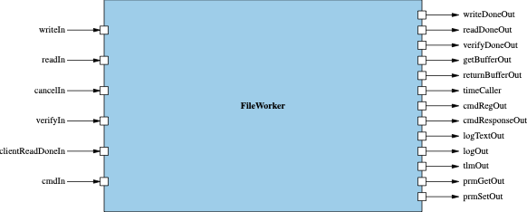

# Svc::FileWorker

Svc::FileWorker is an active F' component used for writing and reading files on the filesystem. Other components needing to read or write files may use this component to perform large/slow file operations without missing their deadlines.

## Requirements

| Name | Description | Validation |
|---|---|---|
|FileWorker-001|FileWorker shall provide an async interface to read contents from a file and return the data in a client-provided buffer|Unit Test|
|FileWorker-002|FileWorker shall provide an interface to write contents to a file passed in from a client-provided buffer|Unit Test|
|FileWorker-003|FileWorker shall handle receiving read-done signals while in improper state|Unit Test|
|FileWorker-004|FileWorker shall handle cancel for reads|Unit Test|

### Diagrams

## States

| State | Description |
|---|---|
| IDLE | FileWorker is ready to accept requests for transfer |
| READING | In the read process |
| WRITING | In the write process |

## Ports

| Kind | Port Name | Port Type | Usage |
|------|------|-----------|-------|
|async input|`writeIn`|`Svc.FileWrite`|Initiates a file write|
|output|`writeDoneOut`|`Svc.SignalDone`|File write has completed|
|async input|`readIn`|`Svc.FileRead`|Initiates a file read|
|output|`readDoneOut`|`Svc.SignalDone`|File read has completed|
|guarded input|`cancelIn`|`Svc.CancelStatus`|Cancels a current operation|
|async input|`verifyIn`|`Svc.VerifyStatus`|Initiates a verification of a file against an expected CRC checksum|
|output|`verifyDoneOut`|`Svc.SignalDone`|File verification results|

## Events

<table><thead><tr style = "border-right: 2px solid black; border-left: 2px solid black; border-top: 2px solid black;">	<th rowspan = "2">Event Name</th>	<th rowspan = "2">Severity</th>	<th rowspan = "2">Description</th>	<th rowspan = "2">Throttle</th>	<th rowspan = "1" colspan = "3" style="text-align: center">Arguments</th></tr><tr style = "border-right: 2px solid black; ">	<th>Name</th>	<th>Type</th>	<th>Description</th></tr></thead><tbody>
<tr style = "border: 2px solid black;"><td rowspan="1"><code>NotInIdle</code></td><td rowspan="1">warning high</td><td rowspan="1">"Not in IDLE state, currently in state: {}"</td><td rowspan="1">2</td><td><code>currState</code></td><td><code>U32</code></td><td></td></tr>
<tr style = "border: 2px solid black;"><td rowspan="1"><code>CrcFailed</code></td><td rowspan="1">warning high</td><td rowspan="1">"Failed CRC check with {} status"</td><td rowspan="1">2</td><td><code>crcStat</code></td><td><code>U32</code></td><td></td></tr>
<tr style = "border: 2px solid black;"><td rowspan="2"><code>CrcVerificationError</code></td><td rowspan="2">warning low</td><td rowspan="2">"Failed to verify file. Expected CRC {}. Actual CRC {}"</td><td rowspan="2"></td><td><code>crcExp</code></td><td><code>U32</code></td><td></td></tr><tr><td><code>crcCalculated</code></td><td><code>U32</code></td><td></td></tr>
<tr style = "border: 2px solid black;"><td rowspan="1"><code>ReadFailedFileSize</code></td><td rowspan="1">warning high</td><td rowspan="1">"Failed to get filesize with stat {} in read handler"</td><td rowspan="1">2</td><td><code>fsStat</code></td><td><code>U32</code></td><td></td></tr>
<tr style = "border: 2px solid black;"><td rowspan="2"><code>OpenFileError</code></td><td rowspan="2">warning high</td><td rowspan="2">"Failed to open file {} with stat {}"</td><td rowspan="2">2</td><td><code>fileName</code></td><td><code>string</code></td><td></td></tr><tr><td><code>size FileNameStringSize
fsStat</code></td><td><code>U32</code></td><td></td></tr>
<tr style = "border: 2px solid black;"><td rowspan="2"><code>ReadBegin</code></td><td rowspan="2">activity low</td><td rowspan="2">"Reading {} bytes from {}"</td><td rowspan="2"></td><td><code>fileSize</code></td><td><code>FwSizeType</code></td><td></td></tr><tr><td><code>fileName</code></td><td><code>string</code></td><td></td></tr>
<tr style = "border: 2px solid black;"><td rowspan="2"><code>ReadCompleted</code></td><td rowspan="2">activity low</td><td rowspan="2">"Finished reading {} bytes from {}"</td><td rowspan="2"></td><td><code>fileSize</code></td><td><code>FwSizeType</code></td><td></td></tr><tr><td><code>fileName</code></td><td><code>string</code></td><td></td></tr>
<tr style = "border: 2px solid black;"><td rowspan="3"><code>ReadError</code></td><td rowspan="3">warning high</td><td rowspan="3">"Failed after {} of {} bytes read to {}"</td><td rowspan="3"></td><td><code>bytesRead</code></td><td><code>FwSizeType</code></td><td></td></tr><tr><td><code>readSize</code></td><td><code>FwSizeType</code></td><td></td></tr><tr><td><code>fileName</code></td><td><code>string</code></td><td></td></tr>
<tr style = "border: 2px solid black;"><td rowspan="3"><code>ReadAborted</code></td><td rowspan="3">warning low</td><td rowspan="3">"Aborted after {} of {} bytes read to {}"</td><td rowspan="3"></td><td><code>bytesRead</code></td><td><code>FwSizeType</code></td><td></td></tr><tr><td><code>readSize</code></td><td><code>FwSizeType</code></td><td></td></tr><tr><td><code>fileName</code></td><td><code>string</code></td><td></td></tr>
<tr style = "border: 2px solid black;"><td rowspan="4"><code>ReadTimeout</code></td><td rowspan="4">warning high</td><td rowspan="4">"Failed after {} of {} bytes read to {} after exceeding timeout of {} microseconds"</td><td rowspan="4"></td><td><code>bytesRead</code></td><td><code>FwSizeType</code></td><td></td></tr><tr><td><code>readSize</code></td><td><code>FwSizeType</code></td><td></td></tr><tr><td><code>fileName</code></td><td><code>string</code></td><td></td></tr><tr><td><code>size FileNameStringSize
timeout</code></td><td><code>U64</code></td><td></td></tr>
<tr style = "border: 2px solid black;"><td rowspan="2"><code>WriteBegin</code></td><td rowspan="2">activity low</td><td rowspan="2">"Beginning write of size {} to {}"</td><td rowspan="2"></td><td><code>writeSize</code></td><td><code>FwSizeType</code></td><td></td></tr><tr><td><code>fileName</code></td><td><code>string</code></td><td></td></tr>
<tr style = "border: 2px solid black;"><td rowspan="2"><code>WriteCompleted</code></td><td rowspan="2">activity low</td><td rowspan="2">"Completed write of size {} to {}"</td><td rowspan="2"></td><td><code>writeSize</code></td><td><code>FwSizeType</code></td><td></td></tr><tr><td><code>fileName</code></td><td><code>string</code></td><td></td></tr>
<tr style = "border: 2px solid black;"><td rowspan="4"><code>WriteFileError</code></td><td rowspan="4">warning high</td><td rowspan="4">"Failed after {} of {} bytes written to {} with write status {}"</td><td rowspan="4">2</td><td><code>bytesWritten</code></td><td><code>FwSizeType</code></td><td></td></tr><tr><td><code>writeSize</code></td><td><code>FwSizeType</code></td><td></td></tr><tr><td><code>fileName</code></td><td><code>string</code></td><td></td></tr><tr><td><code>size FileNameStringSize
status</code></td><td><code>I32</code></td><td></td></tr>
<tr style = "border: 2px solid black;"><td rowspan="2"><code>WriteValidationOpenError</code></td><td rowspan="2">warning high</td><td rowspan="2">"Failed to open validation file {} with status {}"</td><td rowspan="2">2</td><td><code>hashFileName</code></td><td><code>string</code></td><td></td></tr><tr><td><code>size FileNameStringSize
status</code></td><td><code>I32</code></td><td></td></tr>
<tr style = "border: 2px solid black;"><td rowspan="2"><code>WriteValidationReadError</code></td><td rowspan="2">warning high</td><td rowspan="2">"Failed to read validation file {} with status {}"</td><td rowspan="2">2</td><td><code>hashFileName</code></td><td><code>string</code></td><td></td></tr><tr><td><code>size FileNameStringSize
status</code></td><td><code>I32</code></td><td></td></tr>
<tr style = "border: 2px solid black;"><td rowspan="3"><code>WriteValidationError</code></td><td rowspan="3">warning low</td><td rowspan="3">"Failed to create hash file {}. Wrote {} bytes when expected to write {} bytes to hash file"</td><td rowspan="3"></td><td><code>hashFileName</code></td><td><code>string</code></td><td></td></tr><tr><td><code>size FileNameStringSize
bytesWritten</code></td><td><code>FwSizeType</code></td><td></td></tr><tr><td><code>hashSize</code></td><td><code>FwSizeType</code></td><td></td></tr>
<tr style = "border: 2px solid black;"><td rowspan="4"><code>WriteTimeout</code></td><td rowspan="4">warning high</td><td rowspan="4">"Failed after {} of {} bytes written to {} after exceeding timeout of {} microseconds"</td><td rowspan="4"></td><td><code>bytesWritten</code></td><td><code>FwSizeType</code></td><td></td></tr><tr><td><code>writeSize</code></td><td><code>FwSizeType</code></td><td></td></tr><tr><td><code>fileName</code></td><td><code>string</code></td><td></td></tr><tr><td><code>size FileNameStringSize
timeout</code></td><td><code>U64</code></td><td></td></tr>
<tr style = "border: 2px solid black;"><td rowspan="3"><code>WriteAborted</code></td><td rowspan="3">warning low</td><td rowspan="3">"Aborted after {} of {} bytes written to {}"</td><td rowspan="3"></td><td><code>bytesWritten</code></td><td><code>FwSizeType</code></td><td></td></tr><tr><td><code>writeSize</code></td><td><code>FwSizeType</code></td><td></td></tr><tr><td><code>fileName</code></td><td><code>string</code></td><td></td></tr>
</tbody></table>

### 3.4 Functional Description

#### 3.4.1 writeIn_handler

Calling component passes in a buffer for writing to file, the file location is *path*, and the offset to start writing at.

1. If not in IDLE state, return NOT_IDLE
2. Set state to WRITING
3. Open a file at the provided path and write contents of client-provided buffer to it
4. After file is finished being written to, also write a validation CRC file
5. Return to client with write size and set state to IDLE

#### 3.4.2 readIn_handler

Calling component passes in a file path *path* to read and a buffer for client to read from

1. If not in IDLE state, return NOT_IDLE
2. Set state to READING
3. Verify checksum. If checksum fails, return FAILED_CRC and set state to IDLE
4. Otherwise, get file size
5. Read from file into buffer provided by the client
6. Send back the buffer and set state to IDLE

#### 3.4.3 verifyIn_handler

1. Verify checksum. If checksum fails, return FAILED_CRC
2. Get file size. If file size fails, return FAILED_FILE_SIZE
3. Return file size to client

#### 3.4.4 cancelIn_handler

1. Set abort flag to true
2. Return DONE status
